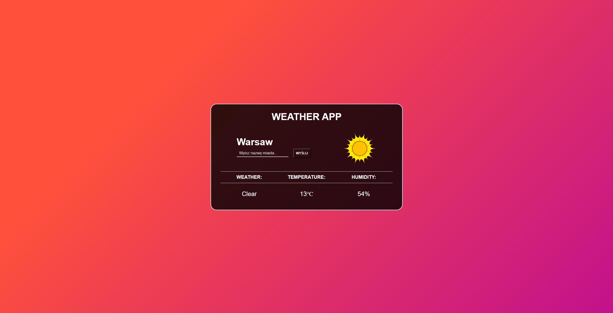

# 🌤️ Weather App



**A simple weather application that provides up-to-date weather information for any location worldwide. This project was developed to solidify my understanding of JavaScript fundamentals before diving into React.**

## Project Overview

The Weather App utilizes the OpenWeatherMap API to fetch real-time weather data based on the provided location. The results are processed and displayed in a user-friendly manner on the page, allowing users to quickly access important weather information.

### Key Features

- **City Search**: Users can enter a city name to retrieve the current weather information.
- **Weather Information**: Displays essential details including:
  - Current weather condition
  - Temperature in Celsius
  - Humidity percentage
- **Weather Icons**: Intuitive icons representing current weather conditions, making the information more accessible.
- **Responsive Design**: The application is designed to be user-friendly across various devices.

### Technologies Used

- **HTML**: Provides the structure for the application.
- **CSS**: Handles the visual styling and layout.
- **JavaScript**: Implements the application logic and handles interactions.
- **Axios**: Used for making HTTP requests to the OpenWeatherMap API.
- **OpenWeatherMap API**: Serves as the data source for weather information.

## How It Works

1. The user inputs a city name into the search box.
2. Upon clicking the "Send" button or pressing Enter, the application constructs a URL to fetch weather data from the OpenWeatherMap API.
3. The fetched data includes:
   - City name
   - Current temperature
   - Humidity
   - Weather description
4. The application updates the display with the retrieved information, including an appropriate weather icon based on the weather condition.

### Local Setup

To run the Weather App locally on your machine, follow these steps:

1. Clone this repository to your local machine:
```
   git clone https://github.com/NartiOfficial/WeatherApp.git
```
  
2. Navigate to the project folder:
```
  cd weather-app
```

3. Open the index.html file in your preferred web browser.


## Example Usage
Input the name of a city (e.g., "Warszawa") and press Enter or click the "Send" button to see the current weather conditions.

## Contributing
Feel free to contribute to this project! You can fork the repository, make changes, and submit a pull request. I would love to see how others can enhance or customize this weather app.

---

Happy coding! 🚀🌐
